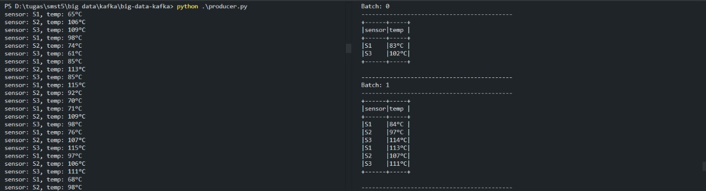

# Simple Kafka

| Nama                     | NRP        |
| ------------------------ | ---------- |
| M. Arkananta Radithya T. | 123456789  |
| Alma Amira Dewani        | 5027221054 |

## Instalasi

Berikut adalah instalasi yang diperlukan

### Docker

1. Unduh Docker versi terbaru dari situs resmi Docker melalui tautan berikut: https://docs.docker.com/desktop/install/windows-install/.
2. Ikuti langkah-langkah instalasi seperti biasa untuk memasang Docker Desktop.

### Java Development Kit (JDK)

1. Unduh JDK 17 versi windows dari situs berikut: https://jdk.java.net/java-se-ri/17
2. Buka Windows Explorer, klik kanan This PC, dan pilih Properties.
3. Klik Advanced System Properties lalu Environment Variables.
4. Di bagian System Variables, klik New dan set `JAVA_HOME` = `C:\jdk-17`.
5. Pilih PATH, klik Edit, dan tambahkan `%JAVA_HOME%/bin`.

### Hadoop 3.3.0

1. Lakukan clonning dari github berikut https://github.com/kontext-tech/winutils/tree/master/hadoop-3.3.0/bin.
2. Atur Environment Variables dengan Memasukkan nama variabel `HADOOP_HOME` dan path ke folder Hadoop sebagai nilai variabel.
3. Temukan variabel “Path” di bawah System Variables dan klik “Edit.” Tambahkan nilai baru `%HADOOP_HOME%bin`.

### Kafka dan Pyspark

```
pip install kafka-python pyspark
```

## Langkah Menjalankan Program

1. Jalankan program docker `docker-compose.yml`.

```
docker-compose up -d
```

2. Untuk mengecek apakah kontainer kafka sudah berjalan.

```
docker ps
```

3. Buat topik kafka untuk data suhu dengan nama "sensor-suhu".

```
docker exec -it kafka kafka-topics.sh --create --topic sensor-suhu --bootstrap-server localhost:9092 --partitions 1 --replication-factor 1
```

4. Jalankan program `producer.py` yang akan mulai mengirim data suhu acak ke topik.

```
python producer.py
```

5. Jalankan program `consumer.py` yang akan mengonsumsi pesan dari topik dan menampilkan data suhu yang melebihi 80°C sebagai peringatan di console.

```
python consumer.py
```

6. Untuk menghentikan kontainer kafka, jalankan

```
docker-compose down
```

## Dokumentasi Hasil


